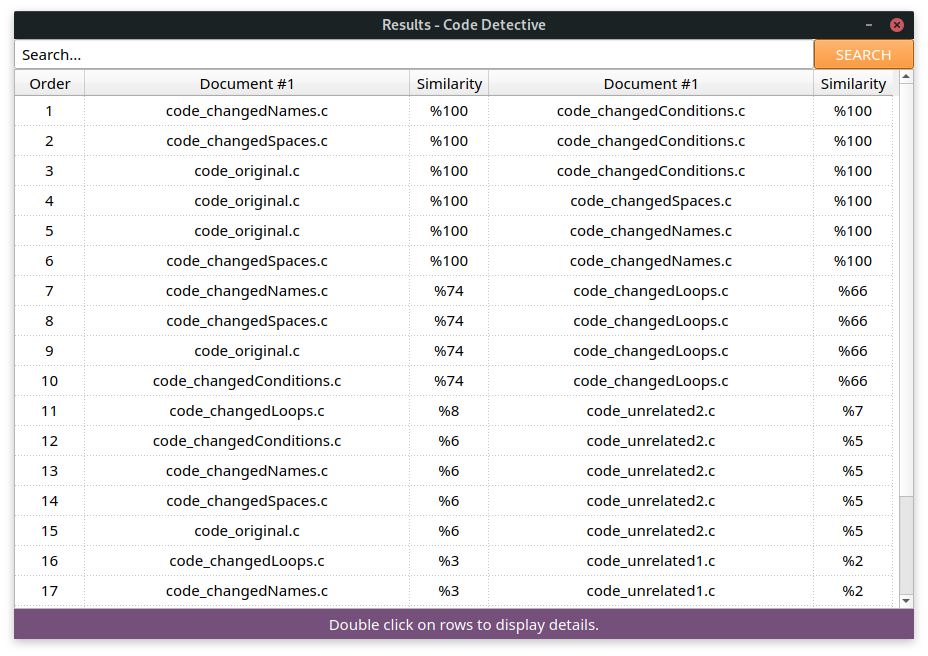

# Code Detective
Code Detective is a software plagiarism detection tool based on MOSS (Measure of Software Similarity) method of Stanford University. It written in C++ and designed with QT Creator. Contributions made by Osman Araz and Muhammet Çeneli, respect to their 1st graduation project of Yıdız Technical University - Computer Engineering department.

## What Code Detective Can Do?
Code Detective detects plagiarisms in seconds for programming source codes such as C, C++, C#, Java and Pyhton and for documents such as TXT and PDF. Code Detective checks plagiarisms for files that given by the user, it doesn't search over internet to check plagiarims.

Code Detective extracts and processes syntaxes of C source codes. Therefore all of the variable names will be same, such as function names will be same, loop types will be same, conditional statement types will be same etc. For other source code types, there is no syntax processing for current version of Code Detective.

## Screenshots
Code Detective provides a useful GUI to end-users.

- Main Page

  

- Results Page: 

  
  
- Details Page: 

  

## How Code Detective Works?
Please check our paper **[here](Paper.pdf)** to understand how Code Detective works.

## Installation
Code Detective is available for Linux, Windows and MacOS. Please check releases [here](https://github.com/arazosman/Code-Detective/releases).

## Compiling
We are very welcome to your contribitions. Please don't hesitate to improve our work and make a pull request. If you want to modify Code Detective, install Qt Creator to your local computer and open the Code Detective QT project in it.
